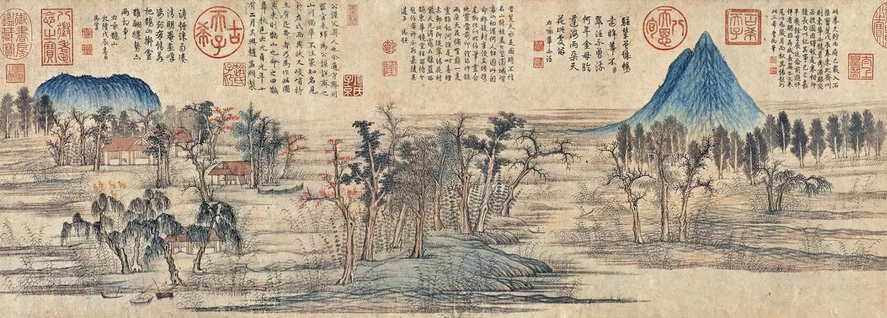

```{r setup, include=FALSE}
knitr::opts_chunk$set(echo = FALSE)
```

I was born in Jinan, Shandong, China (though it's not my actual hometown). The painting below depicts what Jinan looked like in around 1295 C.E. The place I grew up isn't far from that spiky mountain on the right. Today it is still a very spiky mountain, but it's now surrounded by high-rise buildings, and a railway runs underneath. 

```{r, layout="l-screen-inset"}

```
<center>
鹊华秋色图
</center>