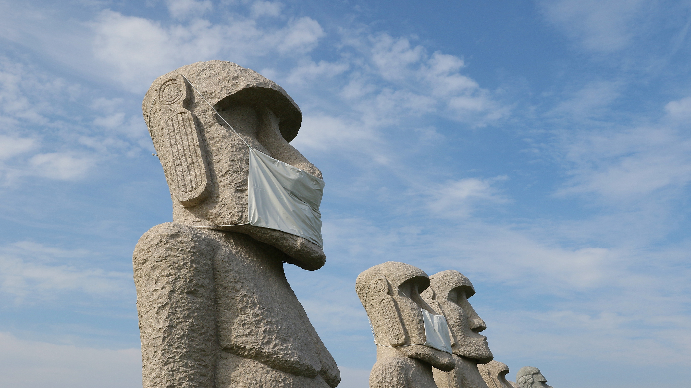
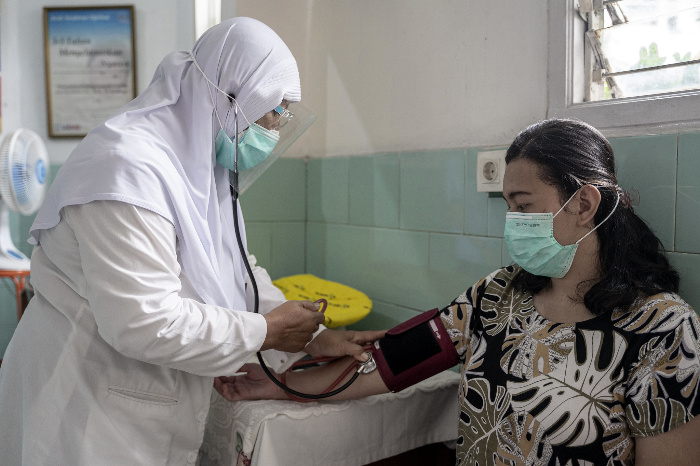
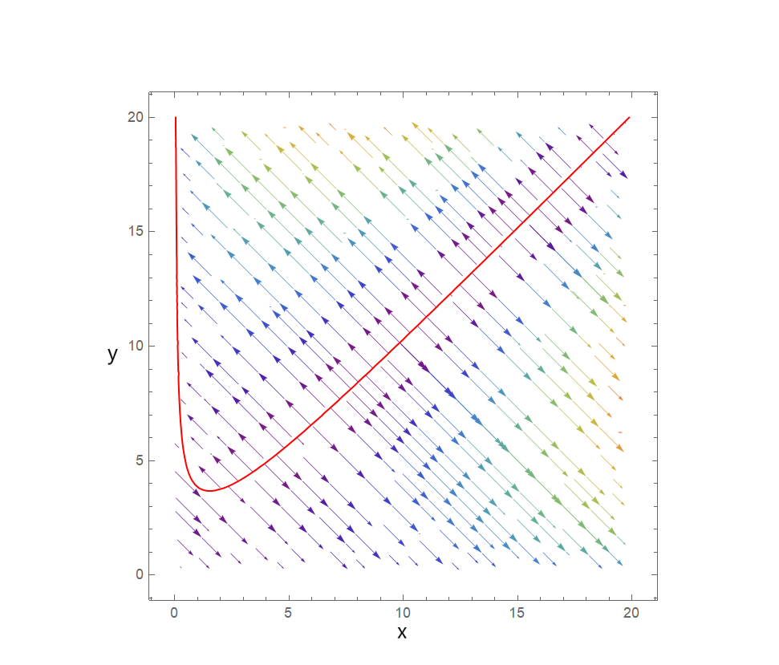
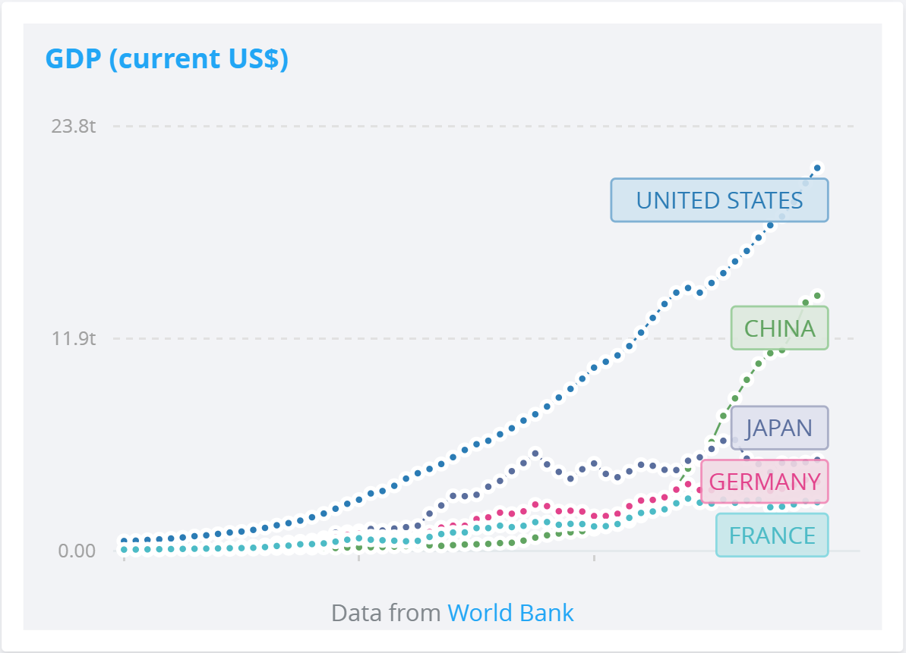
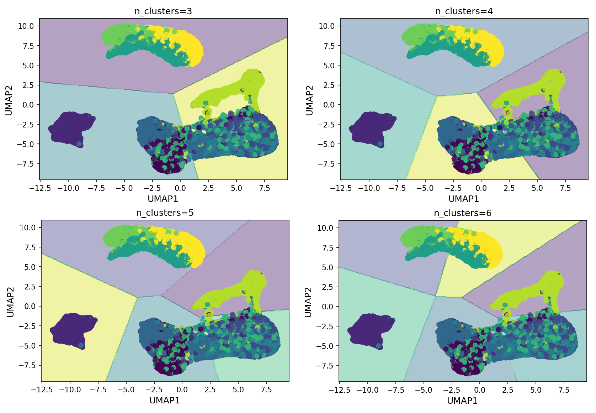
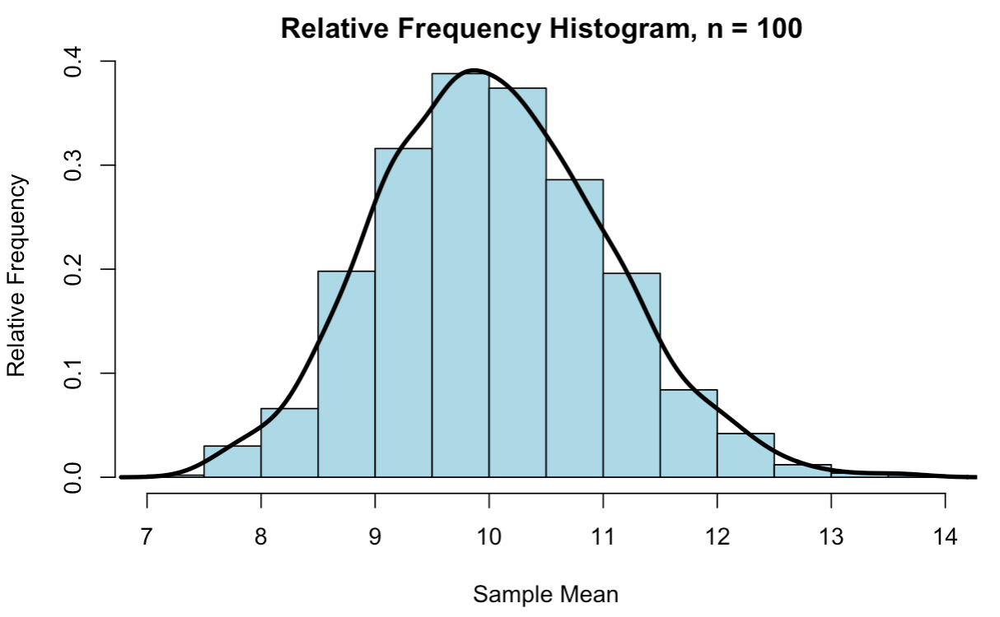
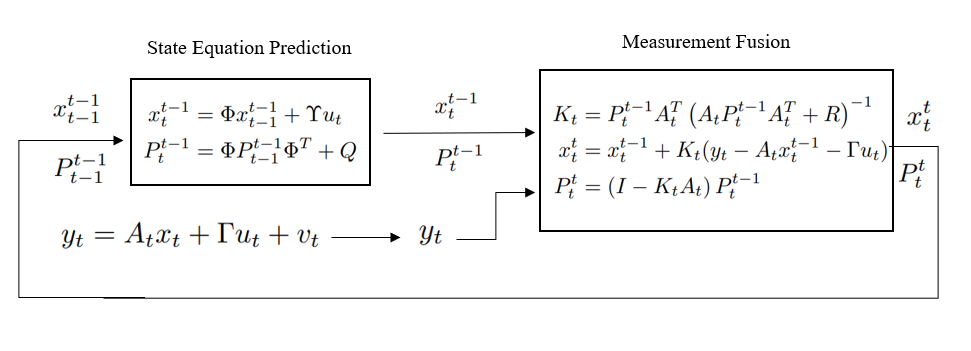

```{r setup, include=FALSE}
knitr::opts_chunk$set(echo = FALSE)
```

```{css, echo = FALSE}
d-article {
grid-template-columns: [screen-start] 1fr [text-start kicker-end] 2% 2% 2% 2% 2% 2% 2% 2% [text-end gutter-start] 2% [middle-end] 2% [page-end gutter-end] 1fr [screen-end];
grid-column-gap: 10%;
}

<style>
body .article {
  max-width: 100%; /* Increase max-width to take more space */
}

/* Additional CSS for side-by-side layout */
.content-section {
  display: flex;
  justify-content: space-between; /* or 'space-around' to include some space between columns */
  align-items: flex-start;
}

.left-column {
  width: 50%; /* Adjust width as necessary */
}

.right-column {
  width: 50%; /* Adjust width as necessary */
}

.right-align-header {
  text-align: right;
}

/* Optional: if you want to ensure there is a little gap between the columns */
.content-section > div {
  padding: 0 10px;
}
</style>
```

## Publication

### [An agent-based model of elephant crop consumption walks using combinatorial optimization](https://www.sciencedirect.com/science/article/pii/S0304380021003902)

<div class="content-section">
  <div class="left-column">

  with Erin Buchholtz, Frederick H. Chen, Susanne Vogel, and Chu A.(Alex) Yu
  
  *Ecological Modelling*. Volume 464, February 2022, 109852
  
  **Abstract**: This paper builds on the framework of utility maximization from economics with the theory of optimal foraging to bring an economic perspective to the issue of elephant crop consumption. Using an agent-based model (ABM) in which elephant agents maximize their energy balance subject to time and movement constraints, we correctly predicted 56% of terrain blocks visited by elephant crop-raiders in Gorongosa National Park, Mozambique from December 2015 to December 2016, which is a 25% improvement in performance compared with two existing models. Findings from this ABM support ecological understanding of elephant crop foraging, highlighting the optimal movements involved in crop foraging events as well as the importance of trespassing costs and landscape configuration.

[[Paper]](https://www.sciencedirect.com/science/article/abs/pii/S0304380021003902) [[Code]](https://github.com/HaosenHe/Elephant-Crop-Raiding)

  </div>
  <div class="right-column">
```{r fig.align='left', out.width='100%', echo=FALSE}
knitr::include_graphics("img/elephant.jpg")
```
<span style="color: #d3d3d3;font-size: 10px;">Big 5 - Elephant @ Caitlin, CC-BY-2.0</span>
  </div>
</div>

## Work in Progress

### Modeling behavioral response to infectious diseases under information delay

<div class="content-section">
  <div class="left-column">
with Frederick H. Chen and Chu A.(Alex) Yu 

Revised and Resubmitted, *Review of Economic Design (Special Issue: Economics of Epidemics)*  

**Abstract**: We formulate and numerically solve a game-theoretic model of rational agents' self-protective actions in an epidemic game with information delay. We show that our model can give rise to multiple equilibria. We then compare our model simulation results with data collected from human players in an online experiment conducted by Chen et al. (2013). Compared with game-theoretic agents, human players receive poorer endgame outcomes as measured by payoffs. In addition, human players' decisions are dependent on their infection history, and they are less responsive to changes in disease prevalence compared to game-theoretic agents. Our results suggest that human players in the epidemic game differ substantially from fully-rational, forward-looking, strategic agents in terms of both game outcomes and decision-making mechanisms.

[[Draft]](https://drive.google.com/file/d/1Gn6-WgHxp7-ajnjCE0x6ntkDbG3G-Hjq/view?usp=sharing) [[Slides]](https://drive.google.com/file/d/1I93NrJagL-VebCUm8KMkyaHDAaSwEvSW/view?usp=sharing)
  </div>
  <div class="right-column">
```{r fig.align='left', out.width='100%', echo=FALSE}

```
<span style="color: #d3d3d3;font-size: 10px;">Moai statues will also wear mask to prevent the spread of the Covid-19! @ MIKI Yoshihito, CC-BY-2.0</span>
</div>
</div>

---

### Improving vaccine access in the developing world through a vaccine trial coalition

<div class="content-section">
  <div class="left-column">

**Abstract**: Clinical trials for new drugs and vaccines are increasingly being conducted in developing countries due to the lower costs of recruiting trial participants and clinicians in these countries. Nonetheless, many developing countries that participated in vaccine trials have difficulties accessing the same vaccines they helped develop. A clinical trial coalition of developing countries will allow member states to collectively bargain with pharmaceutical companies for better access to vaccines during the initial vaccine roll-out, complementing programs such as COVAX, which provides delayed access to vaccines for developing countries when they become widely available. We analyze the feasibility of such an international clinical trial oligopoly using data on COVID-19 vaccine trials and a game-theoretic model involving pharmaceutical companies, developing countries, and developed countries. 

   </div>
  <div class="right-column">
```{r fig.align='left', out.width='100%', echo=FALSE}

```
  </div>
</div>

## Some of my fun undergraduate projects

### [Modeling Language Death](https://drive.google.com/file/d/19qbuV0QyEoR57ZkTQw6ZE3MxUHjJbjis/view?usp=sharing)
```{r, fig.align='center', out.width='50%', echo=FALSE}

```
### [Modeling the Dynamics of National Income](https://drive.google.com/file/d/1JB53sczPZRfsZxH0sHaFlc4Ep4RKVClw/view?usp=drive_link)
```{r, fig.align='center', out.width='50%', echo=FALSE}

```
### [Image Clustering using UMAP](https://drive.google.com/file/d/1ioyFSLdllbfNyXztGsf74DJXo7h5Jcea/view?usp=drive_link)
```{r, fig.align='center', out.width='50%', echo=FALSE}

```
### [Law of Large Numbers & Central Limit Theorem](https://drive.google.com/file/d/1SFwy7gszQD-Ce0rma_i1F1plnqkkBv5C/view?usp=drive_link)
```{r, fig.align='center', out.width='50%', echo=FALSE}

```
### [Kalman Filter and Its Applications in Econometrics](https://drive.google.com/file/d/1caH5bXQue1Q0AIBeNS6gk2sRCeDdiN-P/view?usp=sharing)
```{r, fig.align='center', out.width='50%', echo=FALSE}

```
